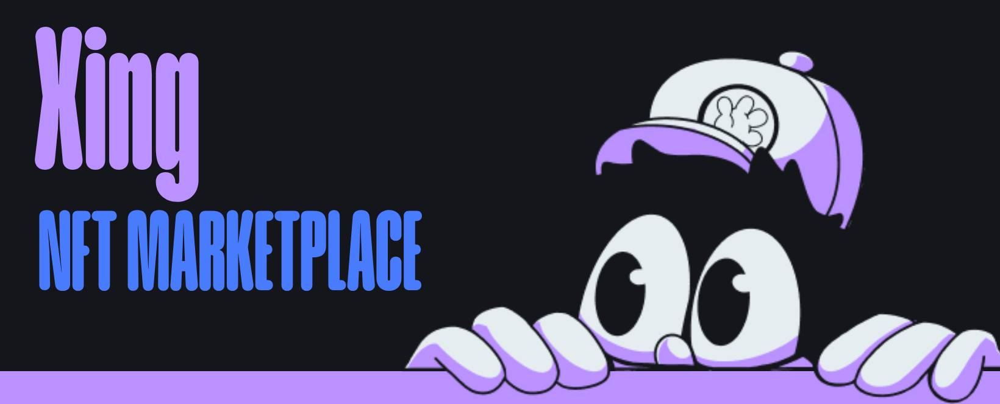

<div>
  <br />
  
</div>

<h3 align="center">🖼️ NFT Marketplace</h3>
  <p align="center">
    A full-stack decentralized NFT marketplace built with <strong>React</strong>, <strong>Node.js</strong>, <strong>Express</strong>, and <strong>MongoDB</strong>.  
    Users can browse, list, and purchase NFTs. Tailwind CSS is used for responsive UI design.
  </p>


---


## 📋 Table of Contents

1. ✨ [Introduction](#introduction)
2. 🧰 [Tech Stack](#tech-stack)
3. ⚡ [Quick Start](#quick-start)
4. 📂 [Project Structure](#project-structure)
5. 🛡️ [License](#license)
6. ✍️ [Author](#author)

---

## <a name="introduction">✨ Introduction</a>

**xXing NFT Marketplace** is a web application that allows users to view and purchase NFTs.  
It includes full-stack functionality with API endpoints, a responsive UI, and a MongoDB database to store NFT listings.

---


## <a name="tech-stack">🧰 Tech Stack</a>

- ⚛️ **React** — Frontend library for building UI
- 🌐 **Node.js + Express** — Backend runtime and framework
- 🛢️ **MongoDB** — NoSQL database
- 🎨 **Tailwind CSS** — Utility-first CSS framework
- 🔗 **Axios** — For API communication

---


## <a name="quick-start">⚡ Quick Start</a>

### 📦 Prerequisites

Ensure you have the following installed:

- [Node.js](https://nodejs.org/)
- [MongoDB](https://www.mongodb.com/)
- [Git](https://git-scm.com/)

---

### 🚀 Run Locally

1. **Clone the repository:**
```bash
git clone https://github.com/AntonChaikovskyi/xing
cd xing
```
2. Install frontend & backend dependencies:

```bash
cd frontend
npm install

cd ../backend
npm install
```

3. Configure environment variables
Create .env file in /backend with:

```
APP_PORT=5050
NODE_ENV=development
MONGODB_URI=
JWT_SECRET=
JWT_EXPIRES_IN=1d

```

4. Start the servers:

Frontend:

```bash
cd frontend
npm run dev
```

Backend:

```bash
cd backend
npm run start
```

---

## <a name="project-structure">📂 Project Structure</a>

```
xing/
├── frontend/              # React frontend
│   ├── public/
│   ├── src/
│   │   ├── assets/
│   │   ├── components/
│   │   ├── lib/
│   │   ├── pages/
│   │   └── App.jsx
│   └── tailwind.config.js
│
├── backend/              # Node.js backend
│   ├── src/
│   │   ├── config/
│   │   ├── database/
│   │   ├── middleware/
│   │   ├── routes/
│   │   ├── routesmodels/
│   │   └── app.js/
│   └── package.json
│
├── README.md
└── LICENSE

```

## <a name="license">🛡️ License</a>

[](LICENSE)

## <a name="author">✍️ Author</a>
💼 GitHub: https://github.com/AntonChaikovskyi

This project was built as part of a university project and personal exploration of NFT technology.
© 2025 All rights reserved.